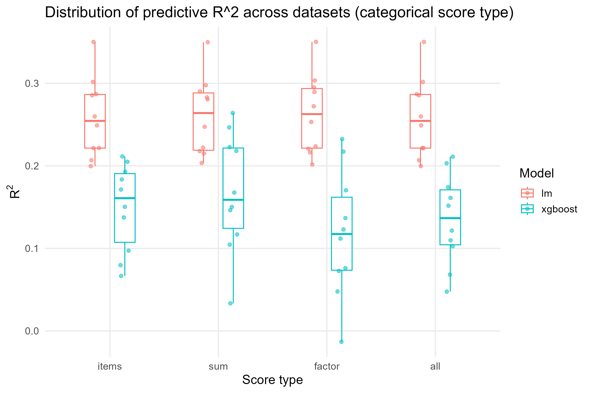
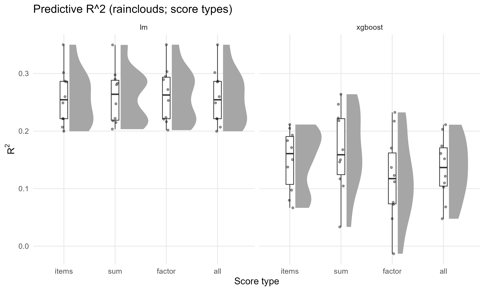

# Simulation Study: Reliability of Predictors in Regression, SEM, and ML

This repository contains a simulation study designed to illustrate, in the context of **regression** and **structural equation modelling (SEM)**, how **predictor reliability** (i.e., the degree to which observed predictors reflect their latent counterparts without measurement error) affects model estimation and predictive performance.

The study reproduces, in simplified form, ideas discussed in *Beyond the Hype: A Simulation Study Evaluating the Predictive Performance of Machine Learning Models in Psychology* (Jankowsky et al., 2024). It places these ideas in the tradition of **classical regression and SEM**, where measurement error has been studied extensively.

------------------------------------------------------------------------

## Contents

-   **01_simulate_cfa.R**\
    Generates **CFA-style synthetic datasets**. Specifically:

    -   Simulates **two correlated latent factors** (F1, F2) with user-defined correlation (`r_F12`).
    -   Creates **six items** (X1–X6) with simple-structure loadings (`.80, .70, .60`) and residuals chosen for unit variance.
    -   Constructs an outcome **Y** from the **true factors** with a target latent **R²** (`R2_target_Y`).
    -   Saves, per replicate:  
        1) `*_items.csv` with **Y + items**, and  
        2) `*_latent.csv` with **true factors**.  
        Also writes a **manifest** (`data/sim_cfa/manifest.csv`) describing dataset ID, loadings, factor correlation, replicate number, seed, and empirical checks.

-   **02_train_cfa.R**\
    Trains predictive models on the CFA datasets. Specifically:

    -   Reads datasets from the manifest and applies a **70/30 train/test split** (reproducible).
    -   Fits **ordinary least squares (OLS) regression** and, optionally, **gradient boosted trees (XGBoost)** on:
        -   **Raw items** (`score_type = "items"`).
        -   **Sum/mean scores** per factor (`"sum"`, mean of X1–X3 for F1 and X4–X6 for F2).
        -   **CFA factor scores** estimated via `lavaan` (fit on training data only; `score_type = "factor"`).
    -   Saves predictions (true Y and predicted Ŷ) to CSV files.
    -   Produces an **index file** (`data/pred_cfa/pred_index.csv`) linking each dataset to its prediction outputs.

-   **03_validate_cfa.R**\
    Evaluates predictive performance and aggregates results. Specifically:

    -   Loads prediction files and compares predicted values to true outcomes.
    -   Computes two performance metrics: RMSE and R².
    -   Saves detailed results per dataset (`perf_by_dataset.csv`).
    -   Aggregates results by **model** and by **model × score type** (`perf_agg_by_model.csv`, `perf_agg_by_model_score.csv`).

-   **plots.R**\
    Produces detailed visualizations of CFA results. Specifically:

    -   Loads aggregated results (`perf_agg_by_model.csv`, `perf_agg_by_model_score.csv`) and replicate-level results (`perf_by_dataset.csv`).
    -   Generates **facet plots** of R² and RMSE across score types.
    -   Creates **error bar plots** (mean ± SE across replicates).
    -   Produces **replicate-level plots** (jitter + boxplot) and **raincloud plots** for the distribution of predictive performance across replicates.
    -   Saves all plots to `data/out_cfa/` (e.g., `perf_grid_with_se_cfa.png`, `perf_replicates_R2_cfa.png`, `perf_replicates_R2_raincloud_cfa.png`, `perf_replicates_RMSE_cfa.png`, `perf_replicates_RMSE_raincloud_cfa.png`).

-   **cleanup.R**\
    Maintains a tidy project structure. Specifically:

    -   Removes bulky intermediate files after simulations are complete.
    -   In `data/sim_cfa/`: keeps only `manifest.csv`, deletes per-replicate datasets.
    -   In `data/pred_cfa/`: keeps only `pred_index.csv`, deletes per-replicate prediction files.
    -   In `data/out_cfa/`: keeps summary metrics (`perf_*.csv`) and plots (`*_cfa.png`), removes leftover scratch files.

-   **scripts/utils_pilot.R**\
    Contains helper functions used across scripts:

    -   `train_test_idx()` – creates reproducible train/test splits.

-   **data/**\
    Project output directory, with subfolders:

    -   `data/sim_cfa/` – simulated CFA datasets + manifest.
    -   `data/pred_cfa/` – prediction outputs + index.
    -   `data/out_cfa/` – validation results and plots.

------------------------------------------------------------------------

## How to Run

1.  Run **`01_simulate_cfa.R`** to generate datasets.
    -   Main settings:
        -   `N`: sample size.
        -   `r_F12`: correlation between F1 and F2.
        -   `load_F1`, `load_F2`: item loadings.
        -   `beta_Y`: coefficients for the true regression `Y ~ F1 + F2`.
        -   `R2_target_Y`: desired latent R².
        -   `replicates`: number of datasets to generate.
    -   Outputs: item and latent CSVs + `manifest.csv`.

2.  Run **`02_train_cfa.R`** to train models and save predictions.
    -   Models: OLS always, XGBoost optional.
    -   Score types: items, sum, factor.
    -   Outputs: per-dataset prediction files in `data/pred_cfa/` and `pred_index.csv`.

3.  Run **`03_validate_cfa.R`** and **plots.R** to compute metrics and visualize results.
    -   Outputs: performance metrics (`perf_by_dataset.csv`, `perf_agg_by_model.csv`, `perf_agg_by_model_score.csv`) and plots in `data/out_cfa/`.

------------------------------------------------------------------------

## Notation and Theoretical Background

In the CFA simulation, **measurement quality** is controlled by **item loadings**:

-   Two factors **F1, F2** with covariance  

    $$
    \Sigma_F=\begin{pmatrix}1 & r_{F12}\\ r_{F12} & 1\end{pmatrix}
    $$

-   Six items **X1–X6** with simple structure loadings (.80, .70, .60).  
    Residual variances are set so each item has variance ≈ 1: $\theta = 1 - \lambda^2$.
-   Outcome **Y** is generated from the **true factors** with noise chosen to match a target latent $R^2$.

------------------------------------------------------------------------

### OLS; why is it relevant?

-   **Ordinary Least Squares (OLS)** regression is the most common method of linear regression.

-   It estimates coefficients by minimizing the sum of squared residuals:

    $$
    Y = \beta_0 + \beta_1X_1 + \beta_2X_2 + \dots + \beta_pX_p + \varepsilon
    $$

-   **In this project:**  
    Because Y is generated linearly from the latent factors, OLS reflects the correct data-generating model.  
    ML models (e.g., XGBoost) are compared to OLS to test robustness against different scoring strategies.

------------------------------------------------------------------------

### Evaluation Metrics

Predictive performance is evaluated using:

-   **Root Mean Squared Error (RMSE):**

    $$
    RMSE = \sqrt{\tfrac{1}{n} \sum (y - \hat{y})^2}
    $$

-   **Coefficient of Determination (R²):**

    $$
    R^2 = 1 - \tfrac{MSE}{Var(Y)}
    $$

------------------------------------------------------------------------

## Results & Interpretation

### Aggregated performance

-   **OLS outperforms XGBoost** across all score types.
-   **Items, sum scores, and factor scores** perform similarly in this simple design.
-   **XGBoost shows higher error** and lower R², since the data-generating process is linear.

### Replicate-level distributions

**Predictive R² across replicates:**

**Predictive RMSE across replicates:**

-   OLS: higher, more stable R² and lower RMSE.
-   XGBoost: lower and more variable results, especially with factor scores.

### Raincloud Plots: Distributions of Predictive Performance

**Predictive R² rainclouds:**

-   **OLS distributions shifted upward**, showing stronger prediction.  
-   **Sum scores ≈ items**, while factor scores add some instability.

**Predictive RMSE rainclouds:**

-   **Lower RMSE for OLS**, consistently across score types.  
-   **XGBoost shows higher errors** and more variability.

------------------------------------------------------------------------

## Summary

This CFA simulation illustrates:

-   **OLS dominates XGBoost** when the true relation is linear.  
-   **Sum scores perform nearly as well as factor scores** in simple measurement structures.  
-   **Measurement model quality bounds prediction**: predictive performance cannot exceed the information conveyed by the observed items.  

------------------------------------------------------------------------
